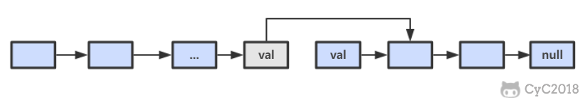

# 高质量代码

## 1. 代码规范性

- 书写 清晰 
- 布局
- 命名合理 变量，函数的意义

##  2. 代码完整性

在面试官出题之后搞清要求，不清楚的趁早了解清楚。

- 功能测试 基本功能以及对应的用例
- 边界测试 打破惯性思维，循环、递归结束条件是否正确？
-  负面测试 可能的错误输入
- 考虑**可扩展性**和**可维护性**。将来需求改变时尽可能*减少代码改动的风险*。

## 3. 错误处理

- 返回值 不同非零返回值代表不同意义 **缺点**：不能直接使用结果需要处理
- 全局变量 可以直接使用返回值，但是需要记得检查全局变量 **缺点**：很容易遗忘
- 异常 **推荐！** 某些语言不支持

### Problem 16 数值整数次方

需要考虑的情况：

- 指数为负数
- 指数为负数且底数为零
- 指数底数都是零
- 如何处理特殊情况？我的代码中使用两个flag（全局变量）

```java
public double Power(double base, int exponent) {
    boolean invalid_flag = false;
    boolean zero_flag = false;
    boolean negative_exp = false;
    if(exponent < 0){
        negative_exp = true;
        exponent = -exponent;
    }
    if(base==0 && negative_exp){
        invalid_flag = true;
        return -1;
    }
    if(base==0 && exponent==0){
        zero_flag = true;
        return 0;
    }
    double res = 1;
    for(int i=1;i<=exponent;i++){
        res = res*base;
    }
    if(negative_exp){
        res = 1.0/res;
    }
    return res;
}
```
### Problem 17  打印从1到最大的n位数

- 大数问题， 如果用int 或者double不能满足上限
- 打印时前面的0要不输出 

```Java
  public void print1ToMaxOfNDigits(int n) {
        if(n<1)
            return;
        char[] numbers = new char[n];
        generateNumbers(numbers, 0, n);
    }
    private void generateNumbers(char[] numbers, int pos, int n){
        if(pos==n)
            doPrint(numbers, n);
        for(int i=0;i<=9;i++){
            numbers[pos] = (char)('0'+i);
            generateNumbers(numbers, pos+1, n);
        }
    }
    private void doPrint(char[] numbers, int n){
        int cur = 0;
        while(cur<=n && numbers[cur]=='0')
            cur++;
        for(int i=cur;i<n;i++){            
            System.out.print(numbers[i]);            
        }
        System.out.println();
    }
```

### Problem 18 删除链表的节点

考虑两种情况：

- 是尾节点，需找到前一个节点，所以从head向后遍历不能避免。 O(n)

  

- 不是尾节点，直接将下一个节点的值赋给目标节点，并删除下一个节点。（**为什么不能直接覆盖当前节点？**因为这样会丢失前面一个节点的指向！！！）时间复杂度为 O(1)。

  

- 是头节点且是唯一节点，返回null

- 综上，如果进行 N 次操作，那么大约需要操作节点的次数为 N-1+N=2N-1，其中 N-1 表示 N-1 个不是尾节点的每个节点以 O(1) 的时间复杂度操作节点的总次数，N 表示 1 个尾节点以 O(N) 的时间复杂度操作节点的总次数。(2N-1)/N ~ 2，因此该算法的平均时间复杂度为 O(1)

```java
public ListNode deleteNode(ListNode pHead, ListNode toBeDel){
    if(pHead==null || toBeDel==null)
        return pHead;
    if(toBeDel.next!=null){//不是尾节点
        ListNode next = toBeDel.next;
        toBeDel.val = next.val;
        toBeDel.next = next.next;
    }
    else{
        if(pHead==toBeDel)
            return null;//头节点&&唯一节点
        ListNode cur = pHead;
        while(cur.next!=toBeDel)
            cur = cur.next;
        cur.next = null;
    }
}
```


